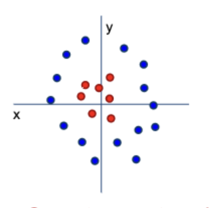
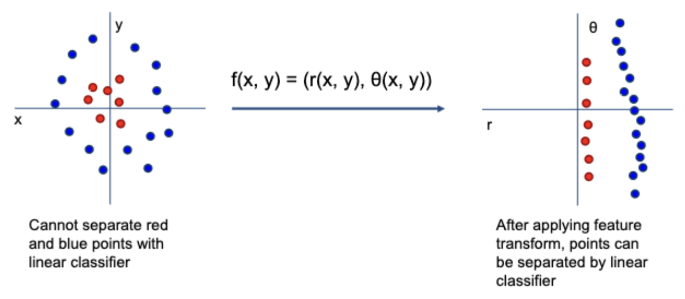
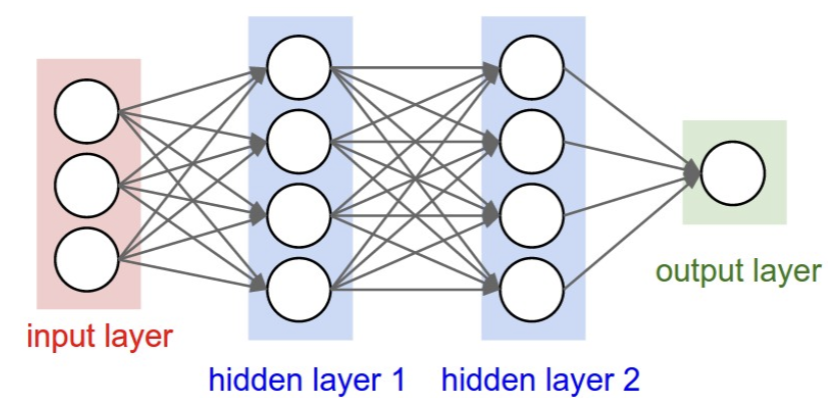

# Lecture 3: Linear Classifier
## CSC 296S - Deep Learning | Dr. Victor Chen

---

## IMPORTANT
This is the foundational lecture that bridges classical ML to deep learning. Everything here - linear classifiers, softmax, cross-entropy, and stacking layers - is exactly what neural networks are built from.

**Key insight from the slides:**

```
Neural Network = Stack of Linear Classifiers + Non-linear Activations
```

---

## 1. Linear Classifier = The Building Block

In deep learning, a linear classifier is also called:
- **Feed-forward layer**
- **Fully Connected Layer (FC)**
- **Dense Layer**

It's just a matrix multiplication between input `x` and weights `W`.

**The Formula:**

```
f(x,W) = Wx + b
```

Where:
- `x` = input vector (your data)
- `W` = weight matrix (learned parameters)
- `b` = bias vector (offset term)
- `f(x,W)` = output scores fro each class

---

# 2. Matrix Multiplication Deep Dive
### 2.1 The Dimensions

For image classification with CIFAR-10 style images:

```
Input image: 32x32x3 = 3,072 pixels (flattened to column vector)
Output: 10 class scores

Dimensions:
[10×1] = [10×3072] × [3072×1] + [10×1]
s      =     W     ×    x     +   b
```

- `W` is a 10×3072 matrix (30,720 learnable weights!)
- Each **row** of W is a "template" for one class
- `b` is a 10×1 bias vector (one bias per class)

### 2.2 Simplified Example

**Setup:** 4-pixel image, 3 classes (cat/dog/ship)

```
Image (2×2):         Flattened:
┌────┬────┐          [56]
│ 56 │231 │    →     [231]
│ 24 │ 2  │          [24]
└────┴────┘          [2]
```

**The Computation:**

```
W                             x        b       s (scores)
┌─────┬─────┬─────┬─────┐   ┌────┐   ┌────┐   ┌───────┐
│ 0.2 │-0.5 │ 0.1 │ 2.0 │   │ 56 │   │1.1 │   │ -96.8 │ ← cat
│ 1.5 │ 1.3 │ 2.1 │ 0.0 │ × │231 │ + │3.2 │ = │ 437.9 │ ← dog
│ 0   │0.25 │ 0.2 │-0.3 │   │ 24 │   │-1.2│   │ 61.95 │ ← ship
└─────┴─────┴─────┴─────┘   │ 2  │   └────┘   └───────┘
                            └────┘
```

**Prediction:** Dog (highest score = 437.9)

---

## 3. The Problem: How Do We Know if W is Good?

Given some weights W, we get scores. But how do we measure if these scores are correct?

**Example:** 3 training images, 3 classes

| Image | True Label | Cat Score | Car Score | Frog Score |
| ----- | ---------- | --------- | --------- | ---------- |
| 🐱    | cat        | 3.2       | 5.1       | -1.7       |
| 🚗    | car        | 1.3       | 4.9       | 2.0        |
| 🐸    | frog       | 2.2       | 2.5       | -3.1       |

Problem: For the cat image, the car score (5.1) is higher than the cat score (3.2). This W is bad!

**We need:**
1. A **loss function** to quantify how wrong our predictions are
2. An **optimization method** to find better W (gradient descent)

---

## 4. From Scores to Probabilities: Softmax

Raw scores can be any number (positive, negative, huge, tiny). We want **probabilities** that:
- Are between 0 and 1
- Sum to 1 across all classes

### 4.1 The Softmax Function

```
P(class_i) = e^(score_i) / Σ e^(score_j)
```

**Two operations:**
1. **Exponentiate** - Makes everything positive, amplifies differences
2. **Normalize** - divide by sum so everything adds to 1

### 4.2 Worked Example

```
Raw scores:           exp():             Normalized (softmax):
cat: 3.2      →    e^3.2 = 24.5    →      24.5/188.68 = 0.13
car: 5.1      →    e^5.1 = 164.0   →      164.0/188.68 = 0.87
frog: -1.7    →    e^-1.7 = 0.18   →      0.18/188.68 = 0.0
                   ─────────────
                   Sum = 188.68           Sum = 1.00
```

**Interpretation:** Model thinks there's an 87% chance it's a car, 13% chance it's a cat.

### 4.3 Terminology

| Term                      | Meaning                                            |
| ------------------------- | -------------------------------------------------- |
| **Logits**                | Raw scores before softmax (can be any real number) |
| **Softmax Probabilities** | Output after softmax (0-1, sum to 1)               |
| **Log-probabilities**     | Another name for logits (because softmax uses exp) |

---

## 5. Cross-Entropy Loss

Now we can compare predicted probabilities to the true label.

### 5.1 The True Label as One-Hot

If the true class is "cat" (class 0 out of 3):

```
True distribution : [1.0, 0.0, 0.0]
					 cat  car  frog
```

### 5.2 Cross-Entropy Formula

```
Loss = -Σ y_true × log(y_pred)
```

Since y_true is one-hot (only one 1, rest are 0s), this simplifies to:

```
Loss = -log(P_predicted for correct class)
```

### 5.3 Worked Example (IMPORTANT)

**Predicted probabilities:** [0.13, 0.87, 0.00] (cat, car, frog)
**True Label:** cat → one-hot: [1, 0, 0]

```
Loss = -(1xlog(0.13) + 0xlog(0.87) + 0xlog(0.00))
	 = -log(0.13)
	 = 2.04
```

**If prediction was perfect (P(cat) = 1.0):**
```
Loss = -log(1.0) = 0 ← Perfect!
```

**If prediction was confident but not wrong** (P(cat) = 0.01):
```
Loss = -log(0.01) = 4.6 ← Very high penalty!
```

### 5.4 Key Properties of Cross-Entropy

- **Perfect prediction** → Loss = 0
- **Confident wrong prediction** → Loss is HUGE (Heavily penalized)
- **Uncertain prediction** → Moderate loss
- This is why neural networks learn to be confident on correct answers

### 5.5 Cross-Entropy vs KL Divergence

| Metric            | Use Case                                                           |
| ----------------- | ------------------------------------------------------------------ |
| **Cross-Entropy** | Supervised learning - comparing predictions to ground truth labels |
| **KL Divergence** | Unsupervised Learning - comparing two probability distributions    |

For classification with one-hot labels, they're mathematically related, but cross-entropy is the standard loss function.

---

## 6. The Training Loop (Preview)

```
1. Forward pass: scores = Wx + b
2. Softmax: Probabilities = softmax(scores)
3. Loss: L = cross_entropy(probabilities, true_labels)
4. Backward pass: compute gradients ∂L/∂W and ∂L/∂b
5. Update: W = W - learning_rate x ∂L/∂W
6. Repeat until loss is minimized
```

This is **gradient descent**

---

## 7. The Limitation: What if Data Isn't Linearly Separable?

### 7.1 the Problem 

Some data can't be separated by a straight line/hyperplane:


No single line can separate red from blue!

### 7.2 The Solution: Non-Linear Transform

**Idea:** Transform the data into a new space where it IS linearly separable.

Example: Cartesian (x, y) → Polar (r, θ)

``` 
Original space (x, y):                  Transformed space (r, θ): 
Can't separate linearly       →         CAN separate linearly! 
```



**Key Insight:** Non-linear functions "bend" the space to make classification easier.

---

## 8. Activation Functions (Non-Linear Transforms)

These are the non-linear functions we insert between linear layers:

| Function       | Formula                         | Range     | Notes                                 |
| -------------- | ------------------------------- | --------- | ------------------------------------- |
| **ReLU**       | `max(0, x)`                     | `[0, ∞)`  | Most common, simple, fast             |
| **Leaky ReLU** | `max(0.01x, x)`                 | `(-∞, ∞)` | Fixes "dying ReLU" problem            |
| **Sigmoid**    | `1/(1 + e^(-x))`                | `(0, 1)`  | Old-school, used in output for binary |
| **Tanh**       | `(e^x - e^(-x))/(e^x + e^(-x))` | `(-1, 1)` | Zero-centered sigmoid                 |
| **ELU**        | `x if x>0, else α(e^x - 1)`     | `(-α, ∞)` | Smooth, can go negative               |
**ReLU is the default choice for hidden layers in modern networks.**

---

## 9. Stacking Linear Classifiers = Neural Network

### 9.1 The Key Insight

**One Linear Classifier:**
```
s = Wx
```

**Two-layer neural network:**
```
h = activation(W₁x) ← Hidden layer
s = W₂h ← Output layer 
```

**Or written together:**
```
s = W₂ × activation(W₁ × x)
```

### 9.2 Dimensions Example

``` 
Input: x ∈ ℝ³⁰⁷² (32×32×3 image flattened) 
Hidden: h ∈ ℝ¹⁰⁰ (100 hidden units) 
Output: s ∈ ℝ¹⁰ (10 class scores) 
W₁: 100×3072 (maps input to hidden) 
W₂: 10×100 (maps hidden to output) 
```

``` 
x ──[W₁]──→ h ──[W₂]──→ s 
3072       100          10 
```

### 9.3 Why Does This Work?

- **W₁** learns to extract useful features from raw pixels
- **Activation** introduces non-linearity (bends the space)
- **W₂** learns to classify based on those features

Without the activation function, stacking linear layers is useless:

```
W₂(W₁x) = (W₂W₁)x = W'x ← Still just a linear function!
```

The activation is essential - it's what gives neural networks their power.

### 9.4 Going Deeper

**3-Layer Network:**
```
h₁ = activation(W₁x) 
h₂ = activation(W₂h₁) 
s = W₃h₂
```

**The Pattern:**
```
Linear → Activation → Linear → Activation → ... → Linear → Softmax → Cross entropy
```

More layers = more capacity to learn complex patterns. This is where "deep" learning comes from.

---

## 10. Graphical View: Fully Connected Networks



- Every Input connects to every hidden unit (fully connected)
- Every hidden unit connects to every output
- Each connection has a weight (learned parameter)

**How many linear classifiers are there in a network with 2 hidden layers?**
There are 3 linear classifiers (Input→hidden1, hidden1→hidden2, hidden2→output)

---

## 11. PyTorch Implementation

### 11.1 Single Linear Layer

```python
import torch
import torch.nn as nn

# Linear layer: 20 inputs -> 30 outputs
m = nn.linear(20,30)

# Batch of 128 samples, each with 20 features
input = torch.randn(128, 20)
output = m(input)

print(output.size()) # torch.Size([128, 30])
print(m.weight.size()) # torch.Size([30, 20])
print(m.bias.size()) # torch.Size([30])
```

### 11.2 Linear Classifier (with Softmax)

```python
import torch.nn as nn
import torch.nn.functional as F

class LinearClassifier(nn.Module):
	def __init__(self):
		super().__init__()
		self.linear = nn.Linear(256, 10) # 256 features -> 10 classes
		
	def forward(self, x):
		x = self.linear(x)       # Raw Scores (logits)
		x = F.softmax(x, dim=1)  # Converts to probabilities
		return x
```

### 11.3 Two-Layer Neural Network

```python
class TwoLayerNet(nn.Module):
	def __init__(self):
		super().__init__()
		self.fc1 = nn.Linear(3072, 100) # Input -> Hidden
		self.fc2 = nn.Linear(100, 10) # Hidden -> Output
		
	def forward(self, x):
		x = self.fc1(x) # Linear Transform
		x = F.relu(x) # Non-Linearity
		x = self.fc2(x) # Linear Transform
		x = F.softmax(x, dim=1) # Probabilities
		return x
```

---

## 12. Key Takeaways from Lecture 3

1. **Linear Classifier: f(x, W) = Wx + b** - the fundamental building block
2. **Softmax converts scores to probabilities** - exp() then normalize
3. **Cross-entropy measures prediction errors** - heavily penalizes confident wrong answers
4. **Linear Classifiers can't handle Non-Linear Data** - they can only draw straight decision boundaries
5. **Activation functions introduce non-linearity** - ReLU is the modern default
6. **Neural networks = stacked linear classifiers + activations** - this is literally what deep learning is
7. **Without activations, stacking is pointless** - W₂(W₁x) = W'x, still linear
8. **More layers = more capacity** - can learn increasingly complex patterns
9. **PyTorch makes this easy** - nn.Linear + F.relu + F.softmax
10. **Next up: How do we actually find good W?** - Gradient descent and back-propagation.

---

## Quick Reference : The Full Pipeline

```
┌─────────────────────────────────────────────────────────────────┐
│                          FORWARD PASS                           │
├─────────────────────────────────────────────────────────────────┤
│    Image → Flatten → Linear(W₁) → ReLU → Linear(W₂) → Softmax   │
│ [32×32×3]  [3072]    [100]        [100]  [10]         [10]      │
│                                                    probabilities│
└─────────────────────────────────────────────────────────────────┘
								↓
┌─────────────────────────────────────────────────────────────────┐
│                              LOSS                               │
├─────────────────────────────────────────────────────────────────┤
│     Cross-Entropy(predicted_probs, true_label) → scalar loss    │
└─────────────────────────────────────────────────────────────────┘
								↓
┌─────────────────────────────────────────────────────────────────┐
│                    BACKWARD PASS (NEXT LECTURE)                 │
├─────────────────────────────────────────────────────────────────┤
│            Compute gradients → Update W₁, W₂ → Repeat           │
└─────────────────────────────────────────────────────────────────┘
```


---

*Completed*