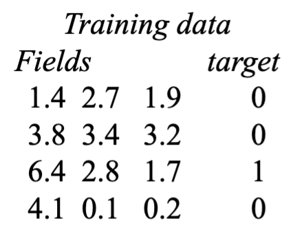

# Lecture 4: Neural Networks and PyTorch
## CSC 296S - Deep Learning | Dr. Victor Chen

---

## Important

**Key Concepts**
- Gradient Descent (How to minimize loss)
- Backpropagation (How gradients flow backward)
- PyTorch Implementation (How to actually code it)

---

## 1. Quick Recap: What we have so far

```
Neural Network = Stacked Linear Classifiers + Activations

x → Linear → ReLU → Linear → ReLU → Linear → Softmax → Loss
    [W₁]            [W₂]            [W₃]               ↓
                                                  Cross-Entropy
```

**The Problem:** We have random weights. How do we make them good?
**Answer:** Gradient Descent!

---

## 2. The Training Loop (Big Picture)



```
Step 1: Initialize random weights
Step 2: Pick a training sample
Step 3: Forward pass -> get prediction
Step 4: Compare to target -> Compute loss
Step 5: Backward pass -> Compute gradients
Step 6: Update weights based on gradients
Step 7: Repeat MILLIONS of times
```

### Visualized:

```
Sample: [1.4, 2.7, 1.9] -> Network -> Output: 0.8
										 ↓
									  Target: 0
									     ↓
									  Error: 0.8
									     ↓
									  Adjust weights(gradient descent)
									     ↓
									  Next sample...
```

## 3. Gradient Descent

### 3.1 The Intuition

Imagine you're blind folded on a hilly landscape and want to find the lowest point:
```
			╱╲ 
		   ╱  ╲ 
		  ╱    ╲ ___ 
		 ╱           ╲ 
		╱              ╲ ___ ╱ 
	   ╱           ↓ 
	  ╱       you are here 
	 ╱
``` 

**Strategy:** Feel the slope under your feet, take a step downhill. Repeat.
That's gradient descent - follow the slope to minimize the loss.

### 3.2 The Formula

```
W = W - α × ∂L/∂W
```

Where:
-  `W` = weights 
-  `α` = learning rate (step size) 
- `∂L/∂W` = gradient (which direction is downhill) 

**The gradient tells you:**
- Which direction increases the loss
- So you go the OPPOSITE direction (hence the minus sign)

### 3.3 Learning Rate (`α`)

The learning rate controls how big each step is:
``` 
Too small (α = 0.0001):   Too big (α = 10):      Just right (α = 0.01): 
Loss                      Loss                     Loss 
│╲                        │    ╱╲  ╱╲              │╲ 
│ ╲                       │   ╱  ╲╱  ╲             │ ╲ 
│  ╲                      │  ╱        ╲            │  ╲___ 
│   ╲___                  │ ╱                      │       ╲__ 
│       ╲___              │╱                       │ 
└──────────── epochs      └──────────── epochs     └──────────── epochs 
Takes forever              Bounces around,          Nicely converges
                           never Converges  
```

---

## 4. Backpropagation

### 4.1  The Problem

We have many layers:
```
x → W₁ → ReLU → W₂ → ReLU → W₃ → Loss
```

The loss depends on W₃, which depends on W₂, which depends on W₁...

**The Question:** How do we know how to adjust `W₁` if it's so far from the loss?

## 4.2 The Chain Rule

Backpropagation uses the **chain rule** from calculus to pass gradients backward through the network.

**Simple Example:**
```
f(x, y, z) = (x + y) × z
```

**Forward Pass:**

```
q = x + y = -2 + 5 = 3
f = q × z = 3 × -4 = -12
```

**Backward pass (what we want):**
``` 
∂f/∂x = ? (how does changing x affect f?)
∂f/∂y = ? (how does changing y affect f?) 
∂f/∂z = ? (how does changing z affect f?) 
```

**Using Chain Rule:**
```
∂f/∂z = q = 3 
∂f/∂q = z = -4 

∂f/∂x = ∂f/∂q × ∂q/∂x = -4 × 1 = -4 
∂f/∂y = ∂f/∂q × ∂q/∂y = -4 × 1 = -4`
```
### 4.3 How Each Neuron Backpropagates

For any operation `z = f(x, y)`

```
     ┌───────────┐ 
x ──→│           │──→ z 
     │      f    │ 
y ──→│           │ 
     └───────────┘


Forward: inputs x, y → output z
Backward: gradient of z → gradients of x, y
```

**The pattern:**
```
gradient_x = local_gradient x upstream_gradient
		   = (∂z/∂x) × (∂Loss/∂z)
```

Each neuron:
1. Receives gradient from the layer above (upstream gradient)
2. Multiplies by its local gradient
3. Passes result to the layer below

This is how gradients "flow backward" through the network.

---

## 5. The Three Key Terms: Step, Batch, Epoch

| Term                 | Definition                                           |
| -------------------- | ---------------------------------------------------- |
| **Batch**            | Number of samples processed before one weight update |
| **Step (Iteration)** | One weight update (one batch processed)              |
| **Epoch**            | One complete pass through the entire training set    |

**Example:**

```
Training data: 1000 samples
Batch Size: 100

Steps per epoch = 1000 / 100 = 10 steps
Each step processes 100 samples
After 10 steps, you've seen all 1000 samples = 1 epoch
```

**Why batches?**
- Can't fit all data in memory at once
- Gradient estimates from batches are noisy but faster
- Noise can actually help escape local minima

---

## 6. Neural Network Training Summary

```
┌─────────────────────────────────────────────────────────────┐
│ STEP 1: Forward Pass                                        │
│ ─────────────────────                                       │
│ Input → Linear → ReLU → Linear → Softmax → Loss             │
│                                             ↓               │
│                                        Compute loss         │
└─────────────────────────────────────────────────────────────┘
								↓
┌─────────────────────────────────────────────────────────────┐
│ STEP 2: Backward Pass                                       │
│ ─────────────────────                                       │
│ Loss → gradients flow backward through each layer           │
│                                                             │
│ Compute: ∂Loss/∂W₃, ∂Loss/∂W₂, ∂Loss/∂W₁                    │
└─────────────────────────────────────────────────────────────┘
								↓
┌─────────────────────────────────────────────────────────────┐
│ STEP 3: Update Weights                                      │
│ ──────────────────────                                      │
│ W₁ = W₁ - α × ∂Loss/∂W₁                                     │
│ W₂ = W₂ - α × ∂Loss/∂W₂                                     │
│ W₃ = W₃ - α × ∂Loss/∂W₃                                     │
└─────────────────────────────────────────────────────────────┘
								↓
							 Repeat!
```

---

## 7. Optimizers (Variations of Gradient Descent)

Basic gradient descent has been improved upon. Here are the main optimizers:

### 7.1 SGD (Stochastic Gradient Descent)

```
W = W - α × gradient
```

- Simple and reliable
- Fixed or decaying learning rate
- Slower but often generalizes better
### 7.2 Adam (Adapt Moment Estimation)

```
Adapts learning rate for each parameter separately
```

- Faster convergence
- Good for prototyping
- Most popular default choice
### 7.3 When to Use What?

| **Situation**                        | **Optimizer**     |
| ------------------------------------ | ----------------- |
| Quick prototyping, need fast results | Adam              |
| Final model, need best accuracy      | SGD (with tuning) |
| Not sure                             | Start with Adam   |

**Visual Comparison:** Adam converges faster, SGD often reaches a better final results

---

## Potential Problems

### 8.1 Local Minima

```
Loss
│    ╱╲
│   ╱  ╲     ╱╲
│  ╱    ╲   ╱  ╲
│ ╱      ╲_╱    ╲___ ← global minimum
│╱   ↑
└────┴───────────────
local minimum (stuck here!)
```

The algorithm might get stuck in a local minimus instead of finding the global minimum.

### 8.2 Learning Rate Issues

**Too High:** Overshoots, never converges, loss bounces around
**Too Low:** Takes forever, might get stuck

**Solution:** Learning rate scheduling (start high, decrease over time)

---

## 9. PyTorch Implementation

### 9.1 Low-Level API (Manual Everything)

```python
class LinearRegression:
	def __init__(self):
		# Random weights with gradient tracking
		self.w = torch.randn(2, 2, requires_grad = true) # 2 x 2 weight matrix
		self.b = torch.randn(2, requires_grad = true) # 2 biases
		
		# requires_grad = True tells PyTorch "track operations on this so we can compute gradients later"
	def forward(self, x):
		# Linear Classifier step: y = Wx + b
		return x @ self.w + self.b
		
	def loss_fn(self, y_pred, y_true):
	# Mean Squared Error: Average of (prediction - actual)²
	return torch.mean((y_pred - y_true) ** 2)
	
model = LinearRegression()

def train_step(model, features, labels):
	# Forward pass
	predictions = model.forward(features)
	loss = model.loss_fn(predictions, labels)
	
	# Backward pass
	loss.backward() # Computes all gradients automatically!
	
	# Update weights (gradient descent)
	with torch.no_grad():
		model.w -= 0.001 * model.w.grad
		model.b -= 0.001 * model.b.grad
		
		# Reset gradients for next iterations
		model.w.grad.zero_() # W = W - α × ∂Loss/∂W
		model.b.grad.zero_()
	
	return loss
```

### 9.2 High-Level API (The Easy Way)

```python
import torch
import torch.nn as nn
import torch.optim as optim

# Defining the model
class FeedForwardModel(nn.Module):
	def __init__(self, imput_size, hidden_size, output_size):
		super().__init__()
		self.fc1 = nn.Linear(input_size, hidden_size) # First Linear Classifier
		self.fc2 = nn.Linear(hidden_size, output_size) # Second Linear Classifier
	
	def forward(self, x):
		x = torch.relu(self.fc1(x)) # Linear again (Hidden layer + ReLU)
		x = self.fc2(x) # Linear again (Output Layer)
		x = torch.log_softmax(x, dim = 1) # Log Probabilities

# Setup		
model = FeedForwardModel(input_size=10, hidden_size=20, output_size=3)
criterion = nn.NLLLoss() # Loss function
optimizer = optim.Adam(model.parameters(), lr = 0.001) # Optimizer

# Training Step
output = model(input_data) # Forward Pass
loss = criterion(output, target) # Compute Loss

optimizer.zero_grad() # Reset gradients
loss.backward() # Backward pass
optimizer.step() # Update weights
```

### 9.3 The Three Magic Lines

This is the training loop you'll write 1000 times:
```python
optimizer.zero_grad() # Clear Old Gradients
loss.backward() # Compute New Gradients
optimizer.step() # Update Weights
```

---
## 10. Full Training Loop

```python
def train_model(model, train_loader, epochs):
	for epoch in range(epochs):
		for batch_features, batch_labels in train_loader:
			# Forward Pass
			output = model(batch_features)
			loss = criterion(output, batch_labels)
			
			# Backward pass + update
			optimizer.zero_grad()
			loss.backward()
			optimizer.step()
			
		print(f"Epoch {epoch}, loss: {loss.item()}")

train_model(model, train_loader, epochs=100)
```

---

## 11. All Together

```python
import torch
import torch.nn as nn
import torch.optim as optim

# Define the model
class FeedForwardModel(nn.Module):
	def __init__(self, input_size, hidden_size, output_size):
		super().__init__()
		self.fc1 = nn.Linear(input_size, hidden_size) # First Linear Classifier
		self.fc2 = nn.Linear(hidden_size, output_size) # Second Linear Classifier
	def forward(self, x):
		x = torch.relu(self.fc1(x)) # Linear -> ReLU
		x = self.fc2(x) # Linear -> raw scores
		return x
		
# SETUP
input_size = 3072 # Example: 32x32x3 Image Flattened
hidden_size = 256 # Our choice
output_size = 10 # 10 Classes
learning_rate = 0.001 # Standard starting point

model = FeedForwardModel(input_size, hidden_size, output_size)
criterion = nn.CrossEntropyLoss() # Loss function for images[CrossEntropy]
optimizer = optim.Adam(model.parameters(), lr = learning_rate) # Optimizer

# Training Loop
epochs = 100

for epoch in range(epochs):
	for batch_features, batch_labels in train_loader:
		# Forward Pass
		output = model(batch_features) # Predict
		loss = criterion(output, batch_labels) # How Wrong?
		
		# Backward pass + update
		optimizer.zero_grad() # Clear Old Gradients
		loss.backward() # Compute Gradients (BackProp)
		optimizer.step() # Update Weights (W = W - α × gradient)
		
	print(f"Epoch {epoch}, Loss: {loss.item()}")

# Use The Model (After Training)
new_image = torch.randn( 1, 3072) # Some new output
prediction = model(new_image) # Get Scores
predicted_class = prediction.argmax() # Highest score = predicted class
```

Define model → Setup optimizer → Loop (forward → loss → backward → update) → Done

---

## 11. Important Notes

### CrossEntropyLoss vs NLLLoss

```python
# Option 1: Use LogSoftMax in model + NLLLoss
class Model(nn.Module):
	def forward(self, x):
		#...
		return torch.log_softmax(x, dim=1) # Log Probabilities

criterion = nn.NLLLoss()

# Option 2: No softmax in model + CrossEntropyLoss
class Model(nn.Module):
	def forward(self, x):
		#...
		return x # Raw Logits

criterion = nn.CrossEntropyLoss() # Includes softmax internally!
```

**Don't apply softmax twice!** CrossEntropyLoss already does it.

### requires_grad = True

```python
self.W = torch.randn(2, 2, requires_grad=True)
```

This tells PyTorch: "Track all operations on this tensor so we can compute gradients later."

---

## 12. Key Takeaways

1. **Gradient descent** minimizes loss by following the slope downhill.
2. **Learning rate** controls step size - too big overshoots, too small is slow.
3. **Backpropagation** uses chain rule to pass gradients from loss back to all weights.
4. **Batch** = samples per update, **Step** = one update, **Epoch** = full pass through data.
5. **Adam** is fast for prototyping, **SGD** often gives better final results.
6. **Local minima** can trap optimizer - not always the best solution.
7. **PyTorch makes it easy:**
```python
optimizer.zero_grad()
loss.backward()
optimizer.step()
```
8. **Don't double-softmax** - use either LogSoftmax + NLLLoss OR raw logits + CrossEntropyLoss.
9. **`requires_grad=True`** enables automatic differentiation on a tensor.
10. **The whole process:** `Forward → Loss → Backward → Update → Repeat millions of times.`
 
---

## Useful Links from Slides

- TensorFlow Playground: https://playground.tensorflow.org 
- 2D Gradient Descent Demo: https://uclaacm.github.io/gradient-descent-visualiser/#playground 
- 3D Gradient Descent Demo: https://www.benfrederickson.com/numerical-optimization 
- 3Blue1Brown Video: https://www.youtube.com/watch?v=IHZwWFHWa-w

---
*Completed*